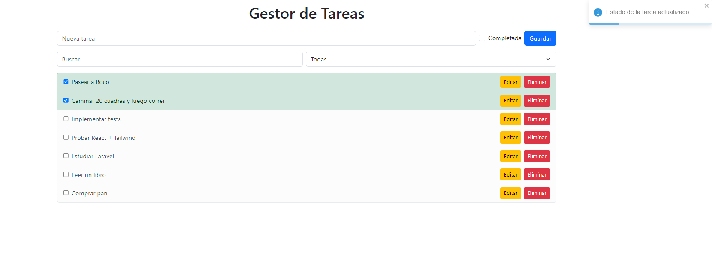
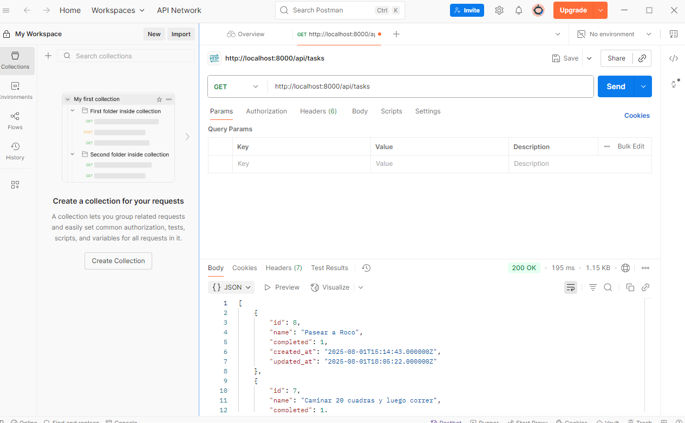
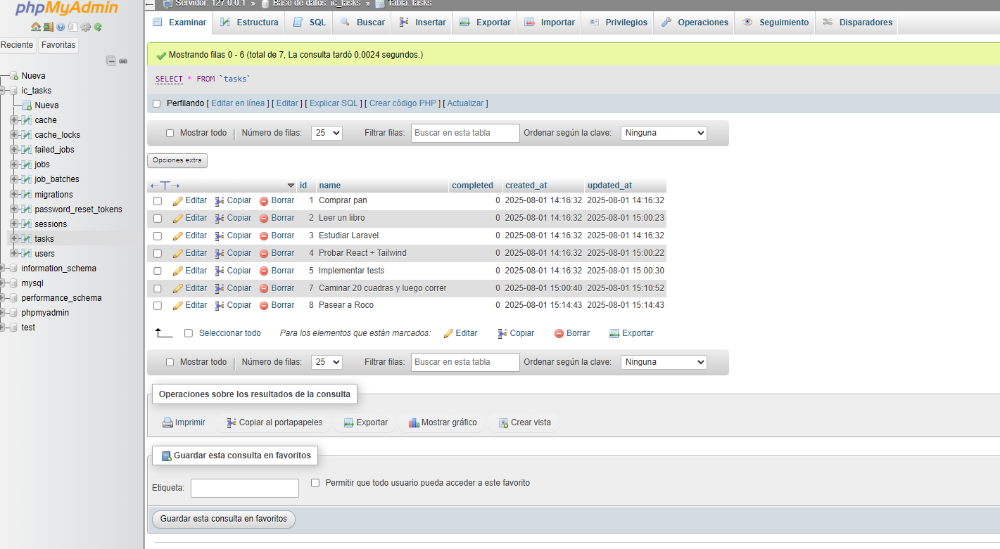

Gestor de Tareas (React + Laravel + XAMPP)

Este proyecto es una aplicación fullstack para gestionar tareas.
Incluye:
- Backend: Laravel (API REST) con MySQL usando XAMPP.
- Frontend: React con Bootstrap.

-------------------------------------------------
REQUISITOS PREVIOS
-------------------------------------------------
- XAMPP (Apache y MySQL)
- PHP 8.x
- Composer
- Node.js y npm

-------------------------------------------------
ESTRUCTURA DEL PROYECTO
-------------------------------------------------
Task_final/
  ic-tasks-backend/   # API Laravel
  ic-tasks-frontend/  # Frontend React

-------------------------------------------------
CONFIGURACIÓN DEL BACKEND (LARAVEL)
-------------------------------------------------
1. Iniciar Apache y MySQL en XAMPP.

2. Crear la base de datos:
   - Abrir http://localhost/phpmyadmin
   - Crear una base llamada ic_tasks

3. Instalar dependencias
   cd ic-tasks-backend
   composer install

4. Configurar .env
   cp .env.example .env
   Editar estas variables:
   DB_CONNECTION=mysql
   DB_HOST=127.0.0.1
   DB_PORT=3306
   DB_DATABASE=ic_tasks
   DB_USERNAME=root
   DB_PASSWORD=

5. Generar clave de la app
   php artisan key:generate

6. Migrar base de datos
   php artisan migrate:fresh --seed

7. Levantar el servidor
   php artisan serve
   Backend: http://127.0.0.1:8000

-------------------------------------------------
CONFIGURACIÓN DEL FRONTEND (REACT)
-------------------------------------------------
1. Instalar dependencias
   cd ic-tasks-frontend
   npm install

2. Configurar .env
   cp .env.example .env
   REACT_APP_API_URL=http://127.0.0.1:8000/api

3. Iniciar la app React
   npm start
   Frontend: http://localhost:3000

-------------------------------------------------
FUNCIONALIDADES
-------------------------------------------------
- Crear tareas.
- Editar tareas.
- Marcar tareas como completadas o pendientes.
- Eliminar tareas.
- Filtro por nombre y estado.
- Validaciones:
  * No permite nombres vacíos.
  * No permite nombres duplicados.

-------------------------------------------------
FEEDBACK VISUAL
-------------------------------------------------
- Toasts: mensajes al crear, editar, eliminar o errores.
- Spinner de carga mientras se esperan respuestas.
- Colores:
  * Verde: tarea completada.
  * Gris: tarea pendiente.

-------------------------------------------------
ENDPOINTS API
-------------------------------------------------
GET     /api/tasks
POST    /api/tasks
GET     /api/tasks/{id}
PUT     /api/tasks/{id}
DELETE  /api/tasks/{id}

-------------------------------------------------
LOGS
-------------------------------------------------
Ubicación: ic-tasks-backend/storage/logs/laravel.log
Registra:
- Listado de tareas
- Creación de tarea
- Actualización de tarea
- Eliminación de tarea
-------------------------------------------------
CAPUTRAS DE PANTALLA
-------------------------------------------------
### Frontend (React)

### API funcionando (Laravel)

### Base de datos en phpMyAdmin

-------------------------------------------------
AUTOR ALAN CANTO
-------------------------------------------------
Proyecto desarrollado con React + Laravel + MySQL (XAMPP).
